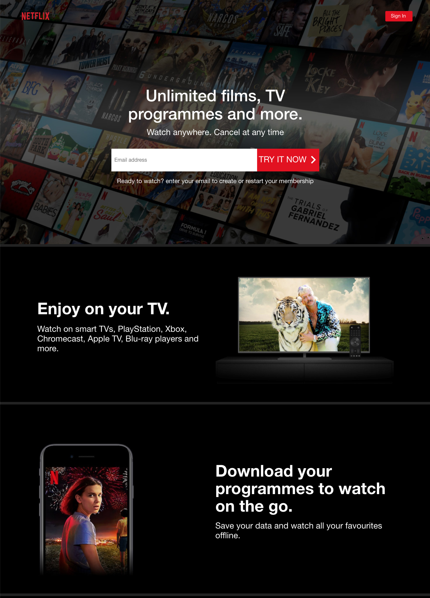
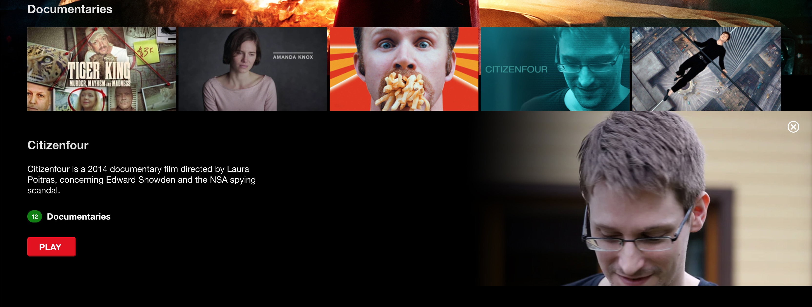

# Netflix clone with basic functionality (Demo: [Netflix Clone](http://my-netflixclone.herokuapp.com))
_Project purpose: learn how to use Styled Components and how to do Registration/Authorization via Firebase_

## Functionality
+ Registration
+ Authorization
+ Films and series browsing (live search within existing content)
+ Sign out

## Technologies

+ React
+ React Context
+ React Hooks
  + useState
  + useEffect
  + useContext
  + Custom hooks
    + useAuth - for authorization checking
    + useContent - for content loading
+ React Router
+ Styled Components
+ Fuse.js (for live search)
+ Firebase
  + Firestore
  + Firebase authenctication (Email and password)
+ React testing library
+ ReactDOM Portal for player overlay

### Home page

### Sign in page

### Sign up page

### Profile choosing

### Browse page

### Selected film

### Player

